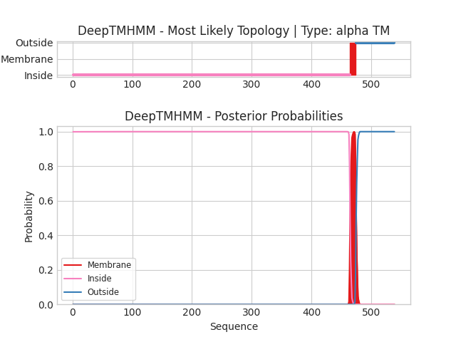

## DeepTMHMM - Predictions
Predicted topologies can be downloaded in [.gff3 format](TMRs.gff3) and [.3line format](predicted_topologies.3line)

You can download the probabilities used to generate this plot [here](seq_L_lactis_lactis_ORF1_1_probs.csv)
### Predicted Topologies
```
>seq_L_lactis_lactis_ORF1_1 | TM
LNAARKANKIVVMKDGQVEDVGSHDVLLRRCQYYQELYYSEQYEDNDE*KKYKKKC*KNYCSMG*EN*KK*RKLRFRRVDSLYRIAWYNFNVSGVKK*R*LKDISEKDRQLY*IYC*QTFNIWAFNRITLFGSSWHCIKYPTFTRR*RKI*ESS**PK*IYRIFRQRKN*RI*FGKHYSS*L*RD*RFIWDTFLSIINQRRAI**FENTHYQFFIKSD*RKQWTNIALHQIGESDVSIRK*DVSTRLFEYGISTWTCWSGLYLSLCPHKRI***SLVVSFAKNYFYL*KV*T*KEKTVSMERWTCSR*IKKRESN*GSKFH*RCMVLWRSRY*SAILIRRISTG**LFCR*SRKNIRVSYAKETWY*FIYDLPWLFWFNRNLFFI*AAIKYKKV*FIHGRI*C***ANS*RIRR*KWHGFS*RNKWLYTGIIEI*IFNQFYLLETSTVTF*RFFERREEEMRRYLILIVALIGITGLSGCYQTSHKKVRFDEGSYTNFIYDNKSYFVTDKEIPQENVNNSKVKFYKLLIVDMKSEKLLX
IIIIIIIIIIIIIIIIIIIIIIIIIIIIIIIIIIIIIIIIIIIIIIIIIIIIIIIIIIIIIIIIIIIIIIIIIIIIIIIIIIIIIIIIIIIIIIIIIIIIIIIIIIIIIIIIIIIIIIIIIIIIIIIIIIIIIIIIIIIIIIIIIIIIIIIIIIIIIIIIIIIIIIIIIIIIIIIIIIIIIIIIIIIIIIIIIIIIIIIIIIIIIIIIIIIIIIIIIIIIIIIIIIIIIIIIIIIIIIIIIIIIIIIIIIIIIIIIIIIIIIIIIIIIIIIIIIIIIIIIIIIIIIIIIIIIIIIIIIIIIIIIIIIIIIIIIIIIIIIIIIIIIIIIIIIIIIIIIIIIIIIIIIIIIIIIIIIIIIIIIIIIIIIIIIIIIIIIIIIIIIIIIIIIIIIIIIIIIIIIIIIIIIIIIIIIIIIIIIIIIIIIIIIIIIIIIIIIIIIIIIIIIIIIIIIIIIIIIIIIIIIIMMMMMMMMMMOOOOOOOOOOOOOOOOOOOOOOOOOOOOOOOOOOOOOOOOOOOOOOOOOOOOOOOOOOOOOOOOO

```


```
##gff-version 3
# seq_L_lactis_lactis_ORF1_1 Length: 539
# seq_L_lactis_lactis_ORF1_1 Number of predicted TMRs: 1
seq_L_lactis_lactis_ORF1_1	inside	1	464				
seq_L_lactis_lactis_ORF1_1	TMhelix	465	474				
seq_L_lactis_lactis_ORF1_1	outside	475	539				

```
