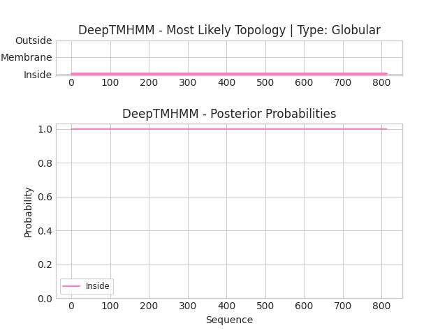

## DeepTMHMM - Predictions
Predicted topologies can be downloaded in [.gff3 format](TMRs.gff3) and [.3line format](predicted_topologies.3line)

You can download the probabilities used to generate this plot [here](seq_L_lactis_lactis_ORF2_1_probs.csv)
### Predicted Topologies
```
>seq_L_lactis_lactis_ORF2_1 | GLOB
VTSDISDDNFVIDKNDSRKIDYMGNIYSISDTTVSDEELGEYQDVLAEVRVFDSVSGKSIPRSEWGRIDKDGSNSKQSRTEWDYGEIHSIRGKSLTEAFAVEINDDFKLATKVGN*SEKNTRFPFYRLFVGFISNCAWGDNKFTTVTLK*Y*YGIN*S*F*CNFIFNRGIND*FD*SRGAVTCSKIDNKD*IGCNWCC*NFITDISCSKRNESFVARNSS*F*IQ*ER*RYK*RSSSSI*G*AT*AK*SSRFNIIDSKK*NPR**EEKS*LRYFLSAY*GKTIKF*RCIWCN**FCFSSILS*S*GSGIS*TTFKKSKSRGTTSIDK*FF*KESKCLYKFT*FLGLSVGYEICDK*WRKLCALPALKENFCWNY*FRNHGRTS*FVK*FRKLF*KSCS*GRV***RT**NWKSK*YCRQNGTRDGSRRSDYSKW*YFRSSTRDYCKYIQSIW*KSFEIGMGS*SNKKSCG*WEQGHQYKCWTVSYDFRIV**WNK*LSRVS*L*VSNKLCNSKRKYCCRSSW***FKHTR*PNNDKLS*AFQKYKGSWKSCRCTECI*GCNSRRWNRWLW*YF*F**YWSGCNLCSCWHNGQF*KIWAR*ICQSGLLFERLAFYNY*YWLVPICLWQLICYS*SIWGTGISS**IWNKES*PTKKVSSNEFSRS*WE*SIEYC*FIEWEK*SF*LRYR*RSG*CY*P*IDGES*RV*GYNETGTR*RNSKKYK*QFFYQK*FS*HFKRSNFS*L*Y*SKNG**SKFERCCFCTKSRNFTCYWRWRRFFTGFRYSVYLNPWYIEKKD*KLIG*KRVGIHSFSFX
IIIIIIIIIIIIIIIIIIIIIIIIIIIIIIIIIIIIIIIIIIIIIIIIIIIIIIIIIIIIIIIIIIIIIIIIIIIIIIIIIIIIIIIIIIIIIIIIIIIIIIIIIIIIIIIIIIIIIIIIIIIIIIIIIIIIIIIIIIIIIIIIIIIIIIIIIIIIIIIIIIIIIIIIIIIIIIIIIIIIIIIIIIIIIIIIIIIIIIIIIIIIIIIIIIIIIIIIIIIIIIIIIIIIIIIIIIIIIIIIIIIIIIIIIIIIIIIIIIIIIIIIIIIIIIIIIIIIIIIIIIIIIIIIIIIIIIIIIIIIIIIIIIIIIIIIIIIIIIIIIIIIIIIIIIIIIIIIIIIIIIIIIIIIIIIIIIIIIIIIIIIIIIIIIIIIIIIIIIIIIIIIIIIIIIIIIIIIIIIIIIIIIIIIIIIIIIIIIIIIIIIIIIIIIIIIIIIIIIIIIIIIIIIIIIIIIIIIIIIIIIIIIIIIIIIIIIIIIIIIIIIIIIIIIIIIIIIIIIIIIIIIIIIIIIIIIIIIIIIIIIIIIIIIIIIIIIIIIIIIIIIIIIIIIIIIIIIIIIIIIIIIIIIIIIIIIIIIIIIIIIIIIIIIIIIIIIIIIIIIIIIIIIIIIIIIIIIIIIIIIIIIIIIIIIIIIIIIIIIIIIIIIIIIIIIIIIIIIIIIIIIIIIIIIIIIIIIIIIIIIIIIIIIIIIIIIIIIIIIIIIIIIIIIIIIIIIIIIIIIIIIIIIIIIIIIIIIIIIIIIIIIIIIIIIIIIIIIIIIIIIIIIIIIIIIIIIIIIIIIIIIIIIIIIIIIIIIIIIIIIIIIIIIIIIIII

```


```
##gff-version 3
# seq_L_lactis_lactis_ORF2_1 Length: 813
# seq_L_lactis_lactis_ORF2_1 Number of predicted TMRs: 0
seq_L_lactis_lactis_ORF2_1	inside	1	813				

```
