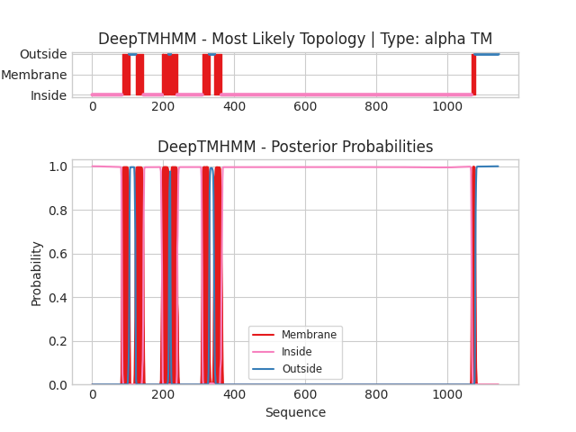

## DeepTMHMM - Predictions
Predicted topologies can be downloaded in [.gff3 format](TMRs.gff3) and [.3line format](predicted_topologies.3line)

You can download the probabilities used to generate this plot [here](seq_L_lactis_lactis_ORF3_1_probs.csv)
### Predicted Topologies
```
>seq_L_lactis_lactis_ORF3_1 | TM
LNFRKFIQLLTVSFMSIITD*LVLNEIKRN*FITHFKGCLFRKNT*NED**MDEVKEFTSKQFFNTLLTLPSTLKLIFQLEKRYAIYLIVLNAITAFVPLASLFIYQDLINSVLGSGRHLINIIIIYFIVQVITTVLGQLESYVSGKFDMRLSYSINMRLMRTTSSLELSDYEQADMYNIIEKVTQDSTYKPFQLFNAIIVVLSSFISLLSSLFFIGTWNIGVAILLLIVPVLSLVLFLRVGQLEFLIQWQRASSERETWYIVYLLTHDFSFKEIKLNNISNYFIHKFGKLKKGFINQDLAIARKKTYFNIFLDFILNLINILTIFAMILSVRAGKLLIGNLVSLIQAISKINTYSQTMIQNIYIIYNTSLFMEQLFEFLKRESVVHKKIEDTEICNQHIGTVKVINLSYVYPNSNAFALKNINLSFEKGELTAIVGKNGSGKSTLVKIISGLYQPTMGIIQYDKMRSSLMPEEFYQKNISVLFQDFVKYELTIRENIGLSDLSSQWEDEKIIKVLDNLGLDFLKTNNQYVLDTQLGNWFQEGHQLSGGQWQKIALARTFFKKASIYILDEPSAALDPVAEKEIFDYFVALSENNISIFISHSLNAARKANKIVVMKDGQVEDVGSHDVLLRRCQYYQELYYSEQYEDNDE*KKYKKKC*KNYCSMG*EN*KK*RKLRFRRVDSLYRIAWYNFNVSGVKK*R*LKDISEKDRQLY*IYC*QTFNIWAFNRITLFGSSWHCIKYPTFTRR*RKI*ESS**PK*IYRIFRQRKN*RI*FGKHYSS*L*RD*RFIWDTFLSIINQRRAI**FENTHYQFFIKSD*RKQWTNIALHQIGESDVSIRK*DVSTRLFEYGISTWTCWSGLYLSLCPHKRI***SLVVSFAKNYFYL*KV*T*KEKTVSMERWTCSR*IKKRESN*GSKFH*RCMVLWRSRY*SAILIRRISTG**LFCR*SRKNIRVSYAKETWY*FIYDLPWLFWFNRNLFFI*AAIKYKKV*FIHGRI*C***ANS*RIRR*KWHGFS*RNKWLYTGIIEI*IFNQFYLLETSTVTF*RFFERREEEMRRYLILIVALIGITGLSGCYQTSHKKVRFDEGSYTNFIYDNKSYFVTDKEIPQENVNNSKVKFYKLLIVDMKSEKLLX
IIIIIIIIIIIIIIIIIIIIIIIIIIIIIIIIIIIIIIIIIIIIIIIIIIIIIIIIIIIIIIIIIIIIIIIIIIIIIIIIIIIIMMMMMMMMMMMMMMMMMMMMMOOOOOOOOOOOOOOOOOMMMMMMMMMMMMMMMMMMMMMMIIIIIIIIIIIIIIIIIIIIIIIIIIIIIIIIIIIIIIIIIIIIIIIIIIIIIMMMMMMMMMMMMMMMMMMMOOOOMMMMMMMMMMMMMMMMMMMIIIIIIIIIIIIIIIIIIIIIIIIIIIIIIIIIIIIIIIIIIIIIIIIIIIIIIIIIIIIIIIIIIIIIIIMMMMMMMMMMMMMMMMMMMMOOOOOOOOOOOOOOMMMMMMMMMMMMMMMMMMMIIIIIIIIIIIIIIIIIIIIIIIIIIIIIIIIIIIIIIIIIIIIIIIIIIIIIIIIIIIIIIIIIIIIIIIIIIIIIIIIIIIIIIIIIIIIIIIIIIIIIIIIIIIIIIIIIIIIIIIIIIIIIIIIIIIIIIIIIIIIIIIIIIIIIIIIIIIIIIIIIIIIIIIIIIIIIIIIIIIIIIIIIIIIIIIIIIIIIIIIIIIIIIIIIIIIIIIIIIIIIIIIIIIIIIIIIIIIIIIIIIIIIIIIIIIIIIIIIIIIIIIIIIIIIIIIIIIIIIIIIIIIIIIIIIIIIIIIIIIIIIIIIIIIIIIIIIIIIIIIIIIIIIIIIIIIIIIIIIIIIIIIIIIIIIIIIIIIIIIIIIIIIIIIIIIIIIIIIIIIIIIIIIIIIIIIIIIIIIIIIIIIIIIIIIIIIIIIIIIIIIIIIIIIIIIIIIIIIIIIIIIIIIIIIIIIIIIIIIIIIIIIIIIIIIIIIIIIIIIIIIIIIIIIIIIIIIIIIIIIIIIIIIIIIIIIIIIIIIIIIIIIIIIIIIIIIIIIIIIIIIIIIIIIIIIIIIIIIIIIIIIIIIIIIIIIIIIIIIIIIIIIIIIIIIIIIIIIIIIIIIIIIIIIIIIIIIIIIIIIIIIIIIIIIIIIIIIIIIIIIIIIIIIIIIIIIIIIIIIIIIIIIIIIIIIIIIIIIIIIIIIIIIIIIIIIIIIIIIIIIIIIMMMMMMMMMMOOOOOOOOOOOOOOOOOOOOOOOOOOOOOOOOOOOOOOOOOOOOOOOOOOOOOOOOOOOOOOOOO

```


```
##gff-version 3
# seq_L_lactis_lactis_ORF3_1 Length: 1142
# seq_L_lactis_lactis_ORF3_1 Number of predicted TMRs: 7
seq_L_lactis_lactis_ORF3_1	inside	1	84				
seq_L_lactis_lactis_ORF3_1	TMhelix	85	105				
seq_L_lactis_lactis_ORF3_1	outside	106	122				
seq_L_lactis_lactis_ORF3_1	TMhelix	123	144				
seq_L_lactis_lactis_ORF3_1	inside	145	197				
seq_L_lactis_lactis_ORF3_1	TMhelix	198	216				
seq_L_lactis_lactis_ORF3_1	outside	217	220				
seq_L_lactis_lactis_ORF3_1	TMhelix	221	239				
seq_L_lactis_lactis_ORF3_1	inside	240	310				
seq_L_lactis_lactis_ORF3_1	TMhelix	311	330				
seq_L_lactis_lactis_ORF3_1	outside	331	344				
seq_L_lactis_lactis_ORF3_1	TMhelix	345	363				
seq_L_lactis_lactis_ORF3_1	inside	364	1067				
seq_L_lactis_lactis_ORF3_1	TMhelix	1068	1077				
seq_L_lactis_lactis_ORF3_1	outside	1078	1142				

```
