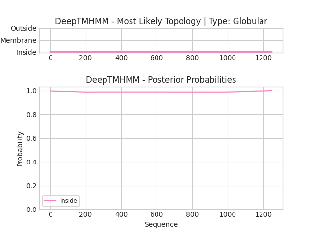

## DeepTMHMM - Predictions
Predicted topologies can be downloaded in [.gff3 format](TMRs.gff3) and [.3line format](predicted_topologies.3line)

You can download the probabilities used to generate this plot [here](seq_L_lactis_lactis_ORF4_1_probs.csv)
### Predicted Topologies
```
>seq_L_lactis_lactis_ORF4_1 | GLOB
L*NRSSDGL*HENSNLSL*YSRKQITKSKDSILLVQTWILSYFYKLFRVAK*LIKIKRGKNMIKSSFKAQPFLVRNTILSPNDKRSFTEYTQVIETVSKNKVFLEQLLLANPKLYDVMQKYNAGLLKKKRVKKLFESIYKYYKRSYLRSTPFGLFSETSIGVFSKSSQYKLMGKTTKGIRLDTQWLIRLVHKMEVDFSKKLSFTRNNANYKFGDRVFQVYTINSSELEEVNIKYTNVYQIISEFCENDYQKYEDICETVTLCYGDEYRELSEQYLGSLIVNHYLISNLQKDLLSDFSWNTFLTKVEAIDEDKKYIIPLKKVQKFIQEYSEIEIGEGIEKLKEIYQEMSQILENDNYIQIDLISDSEINFDVKQKQQLEHLAEFLGNTTKSVRRTYLDDYKDKFIEKYGVDQEVQITELFDSTFGIGAPYNYNHPRNDFYESEPSTLYYSEEEREKYLSMYVEAVKNHNVINLDDLESHYQKMDLEKKSELQGLELFLNLAKEYEKDIFILGDIVGNNNLGGASGRFSALSPELTSYHRTIVDSVERENENKEITSCEIVFLPENIRHANVMHTSIMRRKVLPFFTSTSHNEVLLTNIYIGIDEKEKFYARDISTQEVLKFYITSMYNKTLFSNELRFLYEISLDDKFGNLPWELIYRDFDYIPRLVFDEIVISPAKWKIWGRDVNSKMTIRELIQSKEIPKEFYIVNGDNKVYLSQENPLDMEILESAIKKSSKRKDFIELQEYFEDENIINKGEKGRVADVVVPFIRTRALGNEGRAFIREKRVSVERREKLPFNEWLYLKLYISINRQNEFLLSYLPDIQKIVANLGGNLFFLRYTDPKPHIRLRIKCSDLFLAYGSILEILKRSRKNRIMSTFDISIYDQEVERYGGFDTLELSEAIFCADSKIIPNLLTLIKDTNNDWKVDDVSILVNYLYLKCFFQNDNKKILNFLNLVSTKKVKENVNEKIEHYLKLLKVNNLGDQIFYDKNFKELKHAIKNLFLKMIAQDFELQKVYSIIDSIIHVHNNRLIGIERDKEKLIYYTLQRLFVSEEYMK*GLIDG*SERIHIKTIF*YFTYSSKHLEVNFSVGKTLCNLFNCAKCYHSFCSVG*SFYLSRFNKLCARFRETSYQYYYHLFYCSSDNNSSGTAGKLC*WKI*YATFLQYQYAPHEDYLIS*IK*L*AG*YV*YHRKSYSRQHLQAFSAI*CYHCCAFIVYLIVI*SIFYWNMEHWGSNFTPYCSSIIFGTFS
IIIIIIIIIIIIIIIIIIIIIIIIIIIIIIIIIIIIIIIIIIIIIIIIIIIIIIIIIIIIIIIIIIIIIIIIIIIIIIIIIIIIIIIIIIIIIIIIIIIIIIIIIIIIIIIIIIIIIIIIIIIIIIIIIIIIIIIIIIIIIIIIIIIIIIIIIIIIIIIIIIIIIIIIIIIIIIIIIIIIIIIIIIIIIIIIIIIIIIIIIIIIIIIIIIIIIIIIIIIIIIIIIIIIIIIIIIIIIIIIIIIIIIIIIIIIIIIIIIIIIIIIIIIIIIIIIIIIIIIIIIIIIIIIIIIIIIIIIIIIIIIIIIIIIIIIIIIIIIIIIIIIIIIIIIIIIIIIIIIIIIIIIIIIIIIIIIIIIIIIIIIIIIIIIIIIIIIIIIIIIIIIIIIIIIIIIIIIIIIIIIIIIIIIIIIIIIIIIIIIIIIIIIIIIIIIIIIIIIIIIIIIIIIIIIIIIIIIIIIIIIIIIIIIIIIIIIIIIIIIIIIIIIIIIIIIIIIIIIIIIIIIIIIIIIIIIIIIIIIIIIIIIIIIIIIIIIIIIIIIIIIIIIIIIIIIIIIIIIIIIIIIIIIIIIIIIIIIIIIIIIIIIIIIIIIIIIIIIIIIIIIIIIIIIIIIIIIIIIIIIIIIIIIIIIIIIIIIIIIIIIIIIIIIIIIIIIIIIIIIIIIIIIIIIIIIIIIIIIIIIIIIIIIIIIIIIIIIIIIIIIIIIIIIIIIIIIIIIIIIIIIIIIIIIIIIIIIIIIIIIIIIIIIIIIIIIIIIIIIIIIIIIIIIIIIIIIIIIIIIIIIIIIIIIIIIIIIIIIIIIIIIIIIIIIIIIIIIIIIIIIIIIIIIIIIIIIIIIIIIIIIIIIIIIIIIIIIIIIIIIIIIIIIIIIIIIIIIIIIIIIIIIIIIIIIIIIIIIIIIIIIIIIIIIIIIIIIIIIIIIIIIIIIIIIIIIIIIIIIIIIIIIIIIIIIIIIIIIIIIIIIIIIIIIIIIIIIIIIIIIIIIIIIIIIIIIIIIIIIIIIIIIIIIIIIIIIIIIIIIIIIIIIIIIIIIIIIIIIIIIIIIIIIIIIIIIIIIIIIIIIIIIIIIIIIIIIIIIIIIIIIIIIIIIIIIIIIIIIIIIIIIIIIIIIIIIIIIIIIIIIIIIIIIIIIIIIIIIIIIIIIIIIIIIIIIIIIIIIIIIIIIIIIIIIIIIIIIIIIIIIIIIIIIIIIIIIIIIIIIIIIIIIIIIIIIIIIIIIIIIIIIIIIIIIIIIIIIIIIIIIIIII

```


```
##gff-version 3
# seq_L_lactis_lactis_ORF4_1 Length: 1246
# seq_L_lactis_lactis_ORF4_1 Number of predicted TMRs: 0
seq_L_lactis_lactis_ORF4_1	inside	1	1246				

```
