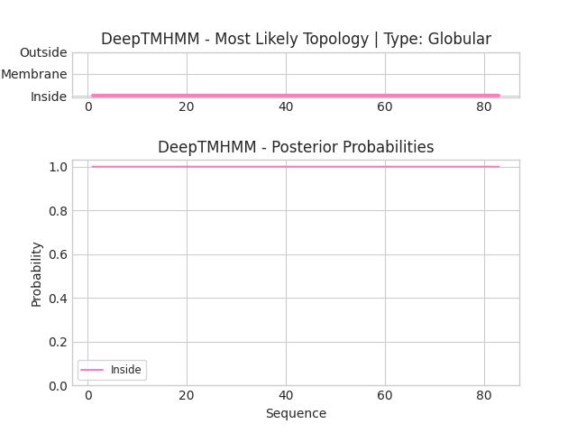

## DeepTMHMM - Predictions
Predicted topologies can be downloaded in [.gff3 format](TMRs.gff3) and [.3line format](predicted_topologies.3line)

You can download the probabilities used to generate this plot [here](seq_L_lactis_lactis_ORF6_1_probs.csv)
### Predicted Topologies
```
>seq_L_lactis_lactis_ORF6_1 | GLOB
FSILDFRLKSLEHSTITGFRYSVYLEY*TIGGKVVYKILIVDDDQEILKLMKTALEMRNYEVATHQNISLPLDITDFQGFDLI
IIIIIIIIIIIIIIIIIIIIIIIIIIIIIIIIIIIIIIIIIIIIIIIIIIIIIIIIIIIIIIIIIIIIIIIIIIIIIIIIIII

```


```
##gff-version 3
# seq_L_lactis_lactis_ORF6_1 Length: 83
# seq_L_lactis_lactis_ORF6_1 Number of predicted TMRs: 0
seq_L_lactis_lactis_ORF6_1	inside	1	83				

```
